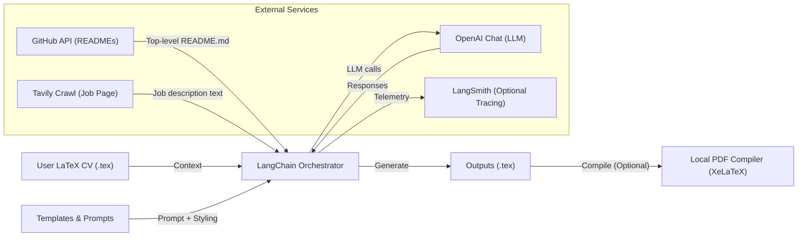

# GitHired — GitHub-based AI CV & Cover Letter Generator

Generate polished, LaTeX-ready CVs and cover letters using your existing CV, your GitHub repositories (top-level READMEs), and live job postings. Powered by LangChain, OpenAI, PyGithub, Tavily, and optional local PDF compilation.

✨ Ideal for AI Engineer / RAG Engineer / Prompt Engineer profiles (configurable).

---

## Features

- Pulls top-level README.md from all your GitHub repositories (private or public with token).
- Rewrites your existing LaTeX CV or designs a new modern template.
- Generates tailored cover letters from a job URL by crawling the posting.
- Produces clean, compilable LaTeX (.tex) output; optional local PDF via xelatex.
- Uses LangChain prompt templates for reproducibility and clarity.
- Tracing support via LangSmith (optional).

---

## Installation

Prerequisites:

- Python 3.10+
- Git (for cloning repos)
- LaTeX distribution (for optional PDF): TeX Live / MiKTeX / MacTeX

Create and activate a virtual environment, then install dependencies:

```bash
# Clone your repo (or download the source)
git clone <your-repo-url>
cd <your-repo-folder>

# Create and activate a virtual environment
python -m venv .venv
# Windows
.venv\Scripts\activate
# macOS/Linux
source .venv/bin/activate

# Install Python deps
pip install -r requirements.txt
```

Set up your environment variables in a `.env` file at the project root:

```bash
# .env (keys only; provide your own values)
GITHUB_TOKEN=
OPENAI_API_KEY=
LANGSMITH_API_KEY=
LANGSMITH_TRACING=
TAVILY_API_KEY=
```

Notes:

- GITHUB_TOKEN must have permission to read your repositories (e.g., `repo` scope for private repos).
- TAVILY_API_KEY is required for job page crawling.
- LANGSMITH\_\* are optional for tracing.

---

## Usage

The default entry point is `src/main.py`, which:

- Generates/rewrites your CV.
- Creates a cover letter tailored to the `JOB_URL` constant inside `src/main.py`.
- Writes outputs into the `outputs/` directory.

Quick start:

```bash
# Run the pipeline (edit JOB_URL in src/main.py first)
python src/main.py
```

Customize behavior:

- To regenerate the CV with GitHub context and updated content, `create_cv(force_update=True)` is used by default in `main.py`.
- To reuse your base CV without regeneration, set `force_update=False` in code.
- To target a different role/focus, update the `fields` arguments in:
  - `src/cv_templates.py` (TEMPLATE_REWRITE / TEMPLATE_NEW)
  - `src/cover_letter/cover_letter_templates.py`
  - or pass different values via `summarize_documents` when integrating.

Programmatic usage:

```bash
python - << 'PY'
from src.main import create_cv, create_cover_letter
from pathlib import Path

# 1) Generate an updated CV (or set force_update=False to reuse base CV in data/)
cv_path = create_cv(force_update=True)

# 2) Generate a cover letter for a specific job posting
job_url = "https://example.com/job-posting"
create_cover_letter(job_url, generate=True, cv_path=cv_path)
PY
```

Outputs:

- `outputs/cv_updated.tex`
- `outputs/cover_letter_updated.tex`

Optional: compile to PDF locally (requires LaTeX installed):

```bash
python - << 'PY'
from src.utils.pdf_compiler import generate_pdf_local

# Compile CV
generate_pdf_local("outputs/cv_updated.tex")

# Compile Cover Letter
generate_pdf_local("outputs/cover_letter_updated.tex")
PY
```

---

## Environment Variables

Provide the following keys in `.env`:

- GITHUB_TOKEN
- OPENAI_API_KEY
- LANGSMITH_API_KEY
- LANGSMITH_TRACING
- TAVILY_API_KEY

No secret values are included in this README. Please supply your own.

---

## Architecture



---

## Project Structure

```plaintext
.
├─ .env                         # Your local secrets (not committed)
├─ requirements.txt             # Python dependencies
├─ src/
│  ├─ main.py                   # Entry point: CV + Cover Letter generation
│  ├─ cv_templates.py           # CV prompt templates (rewrite/new)
│  ├─ git_loader.py             # GitHub auth + README loader
│  ├─ cover_letter/
│  │  ├─ cover_letter_templates.py  # Cover letter prompt templates
│  │  └─ web_scraper.py             # Job page crawler (Tavily)
│  └─ utils/
│     ├─ file_paths.py          # Path utilities and defaults
│     ├─ loaders.py             # Document loaders (CV, cover letter, job page)
│     └─ pdf_compiler.py        # Optional LaTeX → PDF helper
├─ data/
│  ├─ cv_private.tex            # Your base CV (optional)
│  ├─ example_cv.tex            # Fallback example CV
│  ├─ cover_letter_private.tex  # Your base cover letter (optional)
│  └─ example_cover_letter.tex  # Fallback example cover letter
├─ outputs/
│  ├─ cv_updated.tex
│  └─ cover_letter_updated.tex
└─ repos_cache/                  # Cloned repos for README ingestion
```

---

## Notes and Tips

- The system adds a subtle TikZ watermark credit line by default; ensure your LaTeX environment supports `tikz` and `hyperref`.
- Default LLM model is `"gpt-5"` in code; update to your available OpenAI model as needed in `src/main.py` (`summarize_documents`).
- Only top-level `README.md` files are ingested for each repository.
- If you hit rate limits or auth errors, verify your tokens and scopes.
- Overleaf: The generated LaTeX is standard and should compile without custom `.cls`/`.sty` files.

Enjoy your streamlined job applications 🚀
